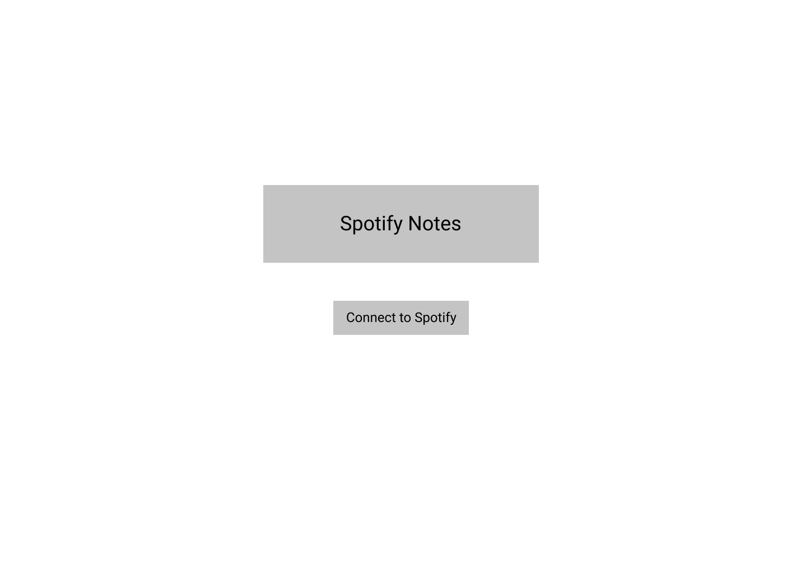
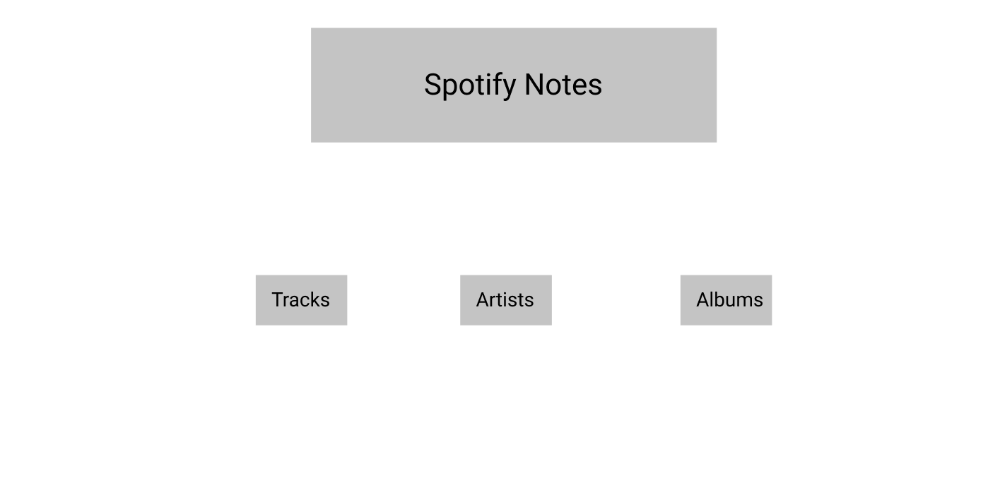
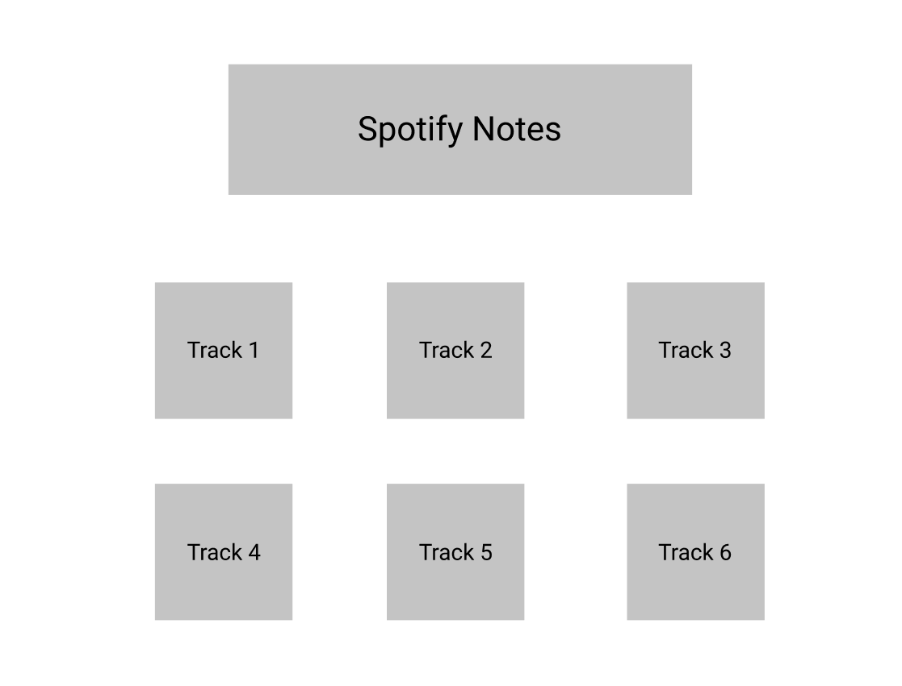
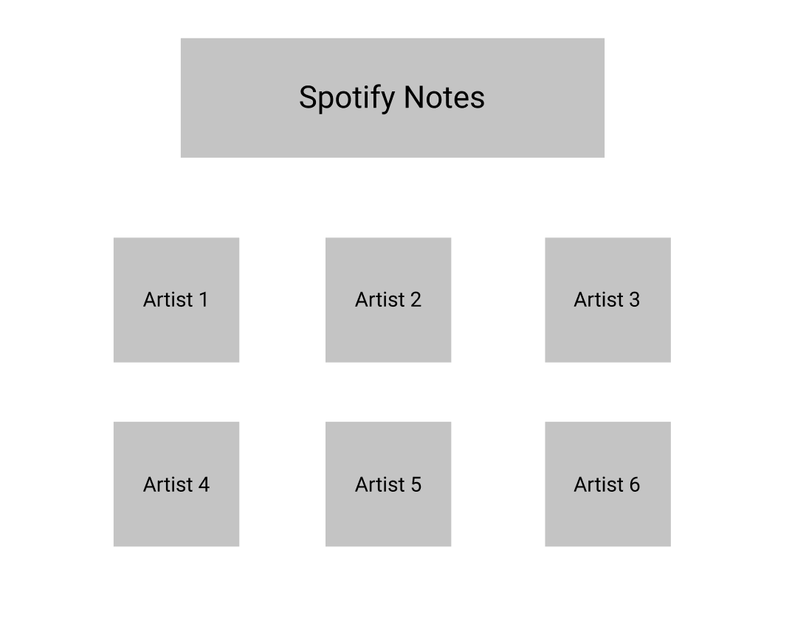
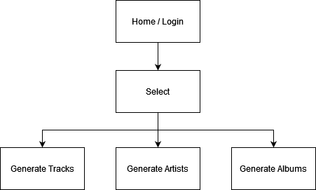

# Spotify Notes

## Overview
Spotify holds a large portion of the music streaming market, so I thought it'd be cool to show off your 
top tracks and artists from the last month, last six months, and all time on Post-It notes. You would be able to download an image and share it with your friends.

## Data Model
The application will store Users.

* users have their top artists and top tracks

An Example User:
```javascript
{
  username: "Cool Kids",
  tracks: // array of tracks
  artists: // array of artists
}
```

## [Link to Commented First Draft Schema](db.js) 

## Wireframes
/ - page for connecting to spotify



/select - page for choosing tracks or artists



/tracks - page for showing tracks



/artists - page for showing artists



## Site map


## User Stories
1. as a user, I can connect to my spotify account
2. as a user, I can generate new post-it notes based on top tracks
3. as a user, I can generate new post-it notes based on top artists

## Research Topics

* (2 points) Use a CSS framework throughout your site, use a reasonable of customization of the framework
    * [material ui](https://mui.com/)
* (4 points) react.js
    * used [react](https://reactjs.org/) for front-end
* (2 points) external API used
    * [spotify api](https://developer.spotify.com/documentation/web-api/) to get content

8 points total out of 8 required points

## [Link to Initial Main Project File](app.js) 

## Annotations / References Used
1. [receiptify](https://github.com/michellexliu/receiptify) - inspiration for this app
